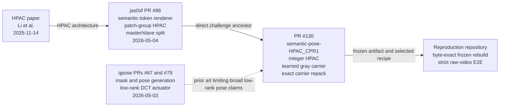

# semantic-pose-HPAC_CPR1 lineage and citations

- **Submission:** `semantic-pose-HPAC_CPR1`
- **Challenge pull request:** [commaai/comma_video_compression_challenge#130][pr130]
- **Reproducibility repository:** [fesalfayed/comma-ai-semantic-pose-hpac-cpr1][repro]
- **As of:** 2026-08-29
- **Scope:** Technical provenance and attribution within the public comma video
  compression challenge lineage. This is not a global patent search or legal
  opinion.

## Executive conclusion

This submission does not claim to introduce the semantic-token plus HPAC codec
family. Its direct public predecessor is jas0xf's merged
[`jas0xf_adversarial_neural_representation` PR #86][pr86]. PR #86 already
combined:

- a semantic class-token stream rendered into RGB;
- patch-group hierarchical autoregressive coding;
- Type-A and Type-B masked convolutions;
- per-frame FiLM conditioning;
- previous-frame token context;
- arithmetic coding; and
- asymmetric master and slave frame renderers.

Those mechanisms are described in jas0xf's technical write-up, particularly
the renderer discussion on page 10 and HPAC discussion on pages 20-21 [3].
They are also present in the immutable merged source [4]. The HPAC architecture
itself derives from Li et al.'s *Rethinking Autoregressive Models for Lossless
Image Compression via Hierarchical Parallelism and Progressive Adaptation*
[1].

The broad ideas of mask/pose-conditioned generation and low-rank spatial pose
actuation also have earlier public challenge precedent in EthanYangTW's qpose
submissions, PRs [#67][pr67] and [#79][pr79]. The qpose decoder constructs a
DCT basis and applies per-frame coefficients with an
`einsum(coefficients, basis)` pattern [7].

Accordingly, this work is a **derived challenge-specific extension**. Its
strongest original contributions within the audited lineage are:

1. an exact integer-lattice implementation of the inherited HPAC backbone,
   with bounded integer intermediates, dyadic requantization, canonical
   entropy logits, and cross-device symbol/token verification [8, 9];
2. a standalone learned low-rank neutral-gray pose carrier replacing PR #86's
   NeRV slave renderer [8];
3. an exact deterministic carrier repack using canonical Huffman and Rice
   streams, with decoded-symbol and archive-hash gates [8, 9];
4. the validation and artifact-integrity system around those components,
   including independent evaluator runs, predecessor cross-GPU validation,
   and frozen equivalence/archive-provenance gates [9, 10]; and
5. the strict 49-stage raw-video-to-official-score reproduction graph in this
   repository, which rejects circular use of the frozen checkpoints and
   archive [10].

“Original within this audited lineage” means the mechanism was not found in
the cited public challenge predecessors. It is deliberately narrower than a
claim of worldwide priority.

## Lineage map



Solid arrows denote verified architectural, repository, or artifact lineage.
The dashed arrow denotes novelty-limiting prior art; it does not assert that
qpose code was copied into this implementation.

## Chronology and immutable anchors

| Date | Artifact | Verified significance |
| --- | --- | --- |
| 2025-11-14 | HPAC paper [1] | Introduced the Hierarchical Parallel Autoregressive ConvNet and hierarchical factorization for practical lossless autoregressive coding. |
| 2026-05-03 | qpose PRs [#67][pr67] and [#79][pr79] | Public mask/pose-conditioned frame generation and low-rank DCT actuation [5-7]. |
| 2026-05-04 | jas0xf PR [#86][pr86], merge `14bcede815306415a0005c3cd98804151bce4049` | Public challenge adaptation combining a semantic-token renderer, NeRV slave, HPAC token model, and arithmetic decoding [2-4]. |
| 2026-07-19 | PR [#130][pr130] and release [`semantic-pose-HPAC_CPR1`][release] | Integer-lattice HPAC, learned gray pose carrier, exact carrier compression, and frozen submission provenance [8, 9]. |
| 2026-07-19 | Reproducibility repository [10] | Frozen byte-exact rebuild plus a non-circular raw-video-to-official-score recipe. |
| 2026-08-08 | `semantic-pose-HPAC_CPR1_polished` PR [#135][pr135] | Public RC64 five-symbol arithmetic coder and exact lossless CPR1 representation improvements [11]. |

The challenge PR is based on a repository state containing the PR #86 merge.
That chronology is mechanically verifiable in the challenge repository:

```text
git merge-base semantic-pose-HPAC_CPR1 \
  14bcede815306415a0005c3cd98804151bce4049

# 14bcede815306415a0005c3cd98804151bce4049
```

This establishes chronology and repository ancestry; it does not by itself
measure scientific novelty.

## Mechanism-by-mechanism assessment

| Mechanism | Verified predecessor | This implementation | Classification |
| --- | --- | --- | --- |
| Semantic class tokens rendered into RGB | PR #86 `TokenRendererV62`; write-up page 10 [3, 4] | Coordinate-aware token embeddings, four dilated residual blocks, frame embeddings, and RGB head [8] | **Inherited concept; new implementation** |
| Two frames with different evaluator roles | PR #86 assigns semantic work to the master and relative-pose work to the slave [3] | Semantic master plus independent gray pose carrier [8] | **Inherited factorization; materially changed slave realization** |
| Patch-group HPAC schedule | HPAC paper and PR #86 [1, 3, 4] | Same patch/group causal factorization [8] | **Inherited** |
| Type-A 7x7 followed by depthwise Type-B 5x5/dilation-2 and 3x3/dilation-4 layers | PR #86 `HPACMini` [4] | Same topology using integer convolution operators [8] | **Direct architectural continuation** |
| Frame conditioning | PR #86 FiLM/frame embedding [3, 4] | Integer frame shift and optional scale [8] | **Inherited mechanism; adapted arithmetic** |
| Previous-frame token context | PR #86 `conv_past` temporal branch [3, 4] | Integer `conv_past` [8] | **Inherited mechanism; adapted arithmetic** |
| Arithmetic/range coding of semantic tokens | PR #86 [2-4] | Canonical integer-logit entropy replay and exact token hashes [8, 9] | **Inherited coding principle; stronger portability contract** |
| Low-rank spatial pose actuation | qpose PRs #67/#79 and merged DCT actuator [5-7] | Learned quantized basis and per-pair coefficients [8] | **Prior art exists; basis/carrier design differs** |
| Standalone neutral-gray pose carrier | No equivalent found in the audited predecessors | `127.5 + amplitude * einsum(coeff, normalized_basis)`, independent of the semantic renderer [8] | **Original within this audited lineage** |
| Integer-lattice HPAC inference | PR #86 uses the same backbone, but not this bounded integer execution path [4] | Integer convolutions/linears, dyadic requantization, bounded activations, and a 1/8-logit lattice [8] | **Original extension within this audited lineage** |
| Canonical Huffman/Rice carrier repack | No equivalent found for this carrier in the audited predecessors | Exact basis/coeff repack, deterministic ZIP, decoded-state equality, and malformed-stream rejection [8, 9] | **Original artifact/codec engineering** |
| RC64 five-symbol arithmetic coding | PR #135 and its public ExperimentBook [11] | Directly adapted as an optional lossless replacement for the inherited range32 token stream; the decoded token grid is required to remain exact | **Inherited from PR #135; not claimed as original** |
| WANS1 fixed-schema renderer coding | PR #135 and its public ExperimentBook [11] | Directly adapted as an optional lossless representation; decoding restores the legacy renderer bytes exactly | **Inherited from PR #135; not claimed as original** |
| CAP1 AR(1)+bias carrier coding | PR #135 and its public ExperimentBook [11] | Directly adapted as an optional lossless representation; decoding restores the canonical CPR1 carrier bytes exactly | **Inherited from PR #135; not claimed as original** |

## Claim boundaries

Supported claims:

- “We made the inherited HPAC entropy path deterministic at the integer
  symbol/logit level.”
- “We replaced the NeRV slave with a standalone learned gray pose carrier.”
- “We exactly repacked that carrier and proved decoded-state equality.”
- “We built a different semantic renderer within the inherited
  semantic-token rendering framework.”
- “We preserved both a byte-exact reconstruction and a strict, non-circular
  raw-video reproduction graph.”

Claims not made:

- “We invented semantic-token HPAC.”
- “We introduced patch-group causal entropy modeling.”
- “We introduced frame conditioning, previous-token context, masked HPAC
  convolutions, or arithmetic-coded HPAC tokens.”
- “We invented asymmetric master/slave evaluator factorization.”
- “We invented low-rank pose actuation.”
- “We invented RC64 or its 63-bit five-symbol arithmetic coder.”
- “We invented WANS1 or CAP1 state coding.”
- “The whole decoder is bit-identical across GPUs.”
- “The Ada result is an official T4 result.”

## Frozen artifact and evaluation evidence

The canonical archive is 191,052 bytes with SHA-256:

```text
0491d5df84fc70b62b3f7ccf8894f5e1b81c616de46a052e4423fc1e18fdc7cd
```

An independent RTX 2000 Ada run completed all 600 samples using the official
evaluator recipe with:

- PoseNet distortion: `0.00001967`;
- SegNet distortion: `0.00028609`;
- compression rate: `0.00508855`; and
- displayed score: `0.17`.

The final challenge-hosted `linux-nvidia-t4` workflow remains the
hardware-specific gate [9, 10].

The CPR1 lossless repack reduced the frozen 194,380-byte predecessor by 3,328
bytes while requiring exact equality of the decoded semantic state, pose
basis, pose coefficients, HPAC model, and token stream [8-10].

The repository's two verification paths deliberately answer different
questions:

- `bash scripts/verify.sh` proves the retained inputs reproduce the canonical
  archive byte-for-byte and runs the repository integrity suite.
- `scripts/e2e.py` rebuilds from raw challenge video and random initialization,
  forbids the frozen artifacts as training inputs, and treats the resulting
  official report—not the frozen hash—as the score oracle.

## Recommended public claim

> We extend jas0xf's public semantic-token/HPAC submission and the underlying
> HPAC architecture with an exact integer-lattice entropy path, a standalone
> quantized learned gray pose carrier, a compact dilated renderer,
> self-compressed model state, and cross-hardware symbol-level verification.
> We do not claim the semantic-token renderer, patch-group HPAC factorization,
> frame conditioning, previous-token context, masked-convolution backbone, or
> arithmetic coding as original. Low-rank pose actuation also has qpose prior
> art; our contribution is the carrier's standalone neutral-gray realization
> and exact packed deployment.

## References

1. Daxin Li, Yuanchao Bai, Kai Wang, Wenbo Zhao, Junjun Jiang, and Xianming
   Liu, “Rethinking Autoregressive Models for Lossless Image Compression via
   Hierarchical Parallelism and Progressive Adaptation,” arXiv:2511.10991,
   submitted 2025-11-14. <https://arxiv.org/abs/2511.10991>
2. jas0xf, “jas0xf_adversarial_neural_representation (0.27),” comma video
   compression challenge PR #86, merged 2026-05-04.
   <https://github.com/commaai/comma_video_compression_challenge/pull/86>
3. jas0xf, “Adversarial Neural Representation,” technical write-up,
   particularly pages 10 and 20-21.
   <https://github.com/jas0xf/comma-anr-supplementary/blob/master/writeup.pdf>
4. Immutable PR #86 renderer, HPAC, and arithmetic-decoder source at merge
   commit `14bcede815306415a0005c3cd98804151bce4049`:
   - <https://github.com/commaai/comma_video_compression_challenge/blob/14bcede815306415a0005c3cd98804151bce4049/submissions/jas0xf_adversarial_neural_representation/inflate.py#L36-L121>
   - <https://github.com/commaai/comma_video_compression_challenge/blob/14bcede815306415a0005c3cd98804151bce4049/submissions/jas0xf_adversarial_neural_representation/inflate.py#L196-L268>
   - <https://github.com/commaai/comma_video_compression_challenge/blob/14bcede815306415a0005c3cd98804151bce4049/submissions/jas0xf_adversarial_neural_representation/inflate.py#L296-L354>
5. EthanYangTW, qpose challenge submission PR #67, merged 2026-05-03.
   <https://github.com/commaai/comma_video_compression_challenge/pull/67>
6. EthanYangTW, “qpose14_r55_segactions_minp v2 (0.31),” challenge PR #79,
   merged 2026-05-03.
   <https://github.com/commaai/comma_video_compression_challenge/pull/79>
7. Immutable qpose v2 source at merge commit
   `c74bd51046481997e4f123e3c24b14f906cac547`:
   - <https://github.com/commaai/comma_video_compression_challenge/blob/c74bd51046481997e4f123e3c24b14f906cac547/submissions/qpose14_r55_segactions_minp/inflate.py#L630-L672>
   - <https://github.com/commaai/comma_video_compression_challenge/blob/c74bd51046481997e4f123e3c24b14f906cac547/submissions/qpose14_r55_segactions_minp/inflate.py#L986-L992>
8. `semantic-pose-HPAC_CPR1` submission implementation:
   - <https://github.com/fesalfayed/comma_video_compression_challenge/blob/semantic-pose-HPAC_CPR1/submissions/semantic-pose-HPAC_CPR1/hpac_integer.py#L165-L239>
   - <https://github.com/fesalfayed/comma_video_compression_challenge/blob/semantic-pose-HPAC_CPR1/submissions/semantic-pose-HPAC_CPR1/inflate.py#L119-L168>
   - <https://github.com/fesalfayed/comma_video_compression_challenge/blob/semantic-pose-HPAC_CPR1/submissions/semantic-pose-HPAC_CPR1/inflate.py#L611-L654>
   - <https://github.com/fesalfayed/comma_video_compression_challenge/blob/semantic-pose-HPAC_CPR1/submissions/semantic-pose-HPAC_CPR1/carrier_codec.py#L54-L140>
   - <https://github.com/fesalfayed/comma_video_compression_challenge/blob/semantic-pose-HPAC_CPR1/submissions/semantic-pose-HPAC_CPR1/repack_carrier.py#L212-L331>
9. Submission portability, equivalence, and artifact records:
   - <https://github.com/fesalfayed/comma_video_compression_challenge/blob/semantic-pose-HPAC_CPR1/submissions/semantic-pose-HPAC_CPR1/README.md>
   - <https://github.com/fesalfayed/comma_video_compression_challenge/blob/semantic-pose-HPAC_CPR1/submissions/semantic-pose-HPAC_CPR1/verification.json>
   - <https://github.com/fesalfayed/comma_video_compression_challenge/blob/semantic-pose-HPAC_CPR1/submissions/semantic-pose-HPAC_CPR1/MANIFEST.sha256>
10. Frozen reproduction source and evidence:
    - [`README.md`](README.md)
    - [`recipe/PROVENANCE.md`](recipe/PROVENANCE.md)
    - [`recipe/TRAINING.md`](recipe/TRAINING.md)
    - [`recipe/artifacts.json`](recipe/artifacts.json)
    - [`evidence/cpr1_verification.json`](evidence/cpr1_verification.json)
    - [`scripts/reproduce.sh`](scripts/reproduce.sh)
    - [`scripts/e2e.py`](scripts/e2e.py)
11. codexblack, `semantic-pose-HPAC_CPR1_polished` challenge PR #135 and
    immutable public ExperimentBook RC64 implementation at commit
    `f229b26735dffc53fdf1ac9987ac7c303298d028`:
    - <https://github.com/commaai/comma_video_compression_challenge/pull/135>
    - <https://github.com/codexblack/CommaVideoCompressionChallenge_ExperimentBook/blob/f229b26735dffc53fdf1ac9987ac7c303298d028/src/cpr1_sub4/entropy/rc64.py>
    - <https://github.com/codexblack/CommaVideoCompressionChallenge_ExperimentBook/blob/f229b26735dffc53fdf1ac9987ac7c303298d028/src/cpr1_sub4/entropy/rc64_backend.c>
    - <https://github.com/codexblack/CommaVideoCompressionChallenge_ExperimentBook/blob/f229b26735dffc53fdf1ac9987ac7c303298d028/docs/F16_RC64.md>

[pr67]: https://github.com/commaai/comma_video_compression_challenge/pull/67
[pr79]: https://github.com/commaai/comma_video_compression_challenge/pull/79
[pr86]: https://github.com/commaai/comma_video_compression_challenge/pull/86
[pr130]: https://github.com/commaai/comma_video_compression_challenge/pull/130
[pr135]: https://github.com/commaai/comma_video_compression_challenge/pull/135
[release]: https://github.com/fesalfayed/comma_video_compression_challenge/releases/tag/semantic-pose-HPAC_CPR1
[repro]: https://github.com/fesalfayed/comma-ai-semantic-pose-hpac-cpr1
